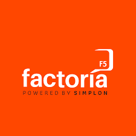
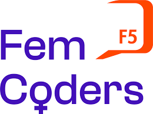

<h1 align="center">👋Hello World</h2>
<p align="center">
  
</p>

<h2  align="center">🚀I'm Kalypso and I'm passionate and curious about programming</h2>
<p align="center">
  
</p>
<h2  align="center">😺A little about me...</h2>

```javascript
const kalypsoDev = {
  realName: "Ángela Antúnez Sánchez",
  location: "Oviedo, Spain",
  focus: ["Full-stack development", "Marketing automation"],
  myGoal: "Build useful, accessible and inclusive applications with UX and human factors in mind",
  languages: [
    "Spanish (native)",
    "English (C1)",
    "French (B2)",
    "Portuguese (research stays)"
  ],

  relevantExperience: [
    {
      duration: "Nov 2024 – Present",
      company: "ECA Teatro",
      website: "https://www.ecateatro.es/",
      role: "Frontend Developer (freelance)",
      technologies: ["HTML", "SCSS", "JavaScript", "Git", "Cloudflare"],
      jobDescription: "Develop and maintain ECA Teatro's website"
    },
    {
      duration: "Oct 2025 – Jul 2026",
      company: "VML The Cocktail",
      role: "Marketing Automation Developer",
      technologies: [
        "Salesforce Marketing Cloud",
        "HTML",
        "CSS",
        "AMPscript",
        "SSJS",
        "SQL"
      ],
      jobDescription: "Worked on Salesforce Marketing Cloud projects for clients in the insurance and airline sectors",
      highlights: [
        "Developed responsive emails in line with brand guidelines and email client compatibility requirements",
        "Supported data management using Data Extensions, including imports and validation",
        "Supported audience segmentation and campaign targeting",
        "Contributed to marketing automation processes and operational improvements",
        "Provided technical support for Salesforce Marketing Cloud campaigns",
        "Participated in specialised Braze training and workshops"
      ]
    },
    {
      duration: "Nov 2024 – Mar 2025",
      company: "TreeHub",
      website: "https://gangenie.ai/",
      role: "Full-stack Developer (freelance)",
      technologies: [
        "HTML5",
        "CSS3",
        "Sass",
        "JavaScript",
        "React",
        "Node.js",
        "Express",
        "MongoDB",
        "Docker",
        "Git",
        "Vite",
        "Rasa",
        "Cloudflare"
      ],
      jobDescription: "Contributed to GanGenie, an AI-powered chatbot designed to provide personalised product recommendations for e-commerce dispensaries"
    },
    {
      duration: "May 2024 – Dec 2024",
      company: "CTIC Technology Centre",
      role: "Web Development, QA and Human Factors Technician",
      technologies: [
        "HTML",
        "CSS",
        "Bootstrap",
        "React",
        "Node.js",
        "Express",
        "MySQL",
        "Python",
        "Docker",
        "Git",
        "Postman"
      ],
      jobDescription: "Worked across the DevOps and Human Factors units",
      highlights: [
        "Developed features for a cardiovascular health web application, including risk calculators and a chatbot, based on Figma designs",
        "Implemented React components and developed Express endpoints",
        "Connected the application to a MySQL database",
        "Performed manual QA testing with Postman and DevTools, including tests of expected user flows",
        "Reviewed performance, responsiveness, SEO and accessibility using PageSpeed Insights and Lighthouse",
        "Contributed to technical and scientific proposals for three projects covering cardiovascular health, smart mobility and employee wellbeing",
        "Sourced, selected, cleaned and processed data for use with an LLM in the cardiovascular health project"
      ]
    }
  ],

  relevantTraining: {
    femCodersFactoriaF5Certification: "Full-stack development bootcamp (850 hours)",
    aspasiaTrainingCertification: "Level 3 Professional Certificate in Web Application Development (590 hours)",
    vmlTheCocktailCertification: "Internal Master's Programme in Marketing Automation - MIND (2026)"
  },

  certifications: {
    Coursera: "Google IT Automation with Python",
    Salesforce: [
      "Salesforce Certified Marketing Cloud Engagement Specialist (Apr 2026)",
      "Salesforce Certified Marketing Cloud Engagement Foundations (Nov 2025)"
    ],
    Braze: [
      "Braze Certified Marketing Specialist (Jul 2026)",
      "Braze Certified Practitioner (Jul 2026)"
    ]
  },

  earlierExperience: [
    {
      duration: "Sep 2022 – May 2024",
      role: "Private Tutor",
      highlights: [
        "Provided academic support to primary school students and taught English and French to secondary school students"
      ]
    },
    {
      duration: "Feb 2021 – Mar 2022",
      company: "AINDACE Foundation (Foundation for Brain Injury Research Support)",
      role: "Social Project Manager",
      highlights: [
        "Managed social projects and adapted leisure activities for service users with disabilities and their families",
        "Organised charity events",
        "Coordinated the volunteer programme and managed the organisation's social media presence",
        "Led communications to raise awareness of brain injury through social media, television, newspapers and radio",
        "Identified funding opportunities and managed grant applications, reporting, donations and sponsorships",
        "Liaised with partner organisations, professionals, service users and families"
      ]
    },
    {
      duration: "Nov 2014 – Jul 2019",
      company: "University of Oviedo",
      programme: "Severo Ochoa Predoctoral Research and Teaching Training Programme (BP14-108)",
      role: "Researcher and Lecturer",
      highlights: [
        "Researched school dropout among Roma students in Asturias as part of the ADIR Research Group",
        "Designed and implemented the ESPIRALES educational intervention programme and trained participating tutors",
        "Taught university courses in Psychology, Education and Pedagogy",
        "Presented research at academic conferences and contributed to scientific publications"
      ]
    }
  ],

  academicBackground: {
    organization: "University of Oviedo",
    qualifications: [
      "International PhD in Education and Psychology, Cum Laude (2020)",
      "Master's Degree in Socio-Educational Intervention and Research (2015)",
      "Master's Degree in Secondary Education Teacher Training – Educational Guidance (2013)",
      "Degree in Psychology, Extraordinary Degree Award (2012)"
    ]
  },

  personalStuff: {
    wasBornIn: "Santander, Spain",
    livingIn: "Oviedo, Spain",
    myMottos: [
      "Curiosity didn't kill the cat: it helped it explore, learn and grow",
      "Every day is an adventure",
      "Just make it happen!",
      "Let's play life-building",
      "Choose your battles wisely",
      "Let your emotions be your friends, not your enemies",
      "Don't dwell on your failures; learn from them",
      "The best antidepressant? Loving yourself!",
      "Don't let fear take root, because love and success cannot bloom"
    ],
    myStrengths: [
      "Curiosity",
      "Passion",
      "Initiative",
      "Motivation",
      "Empathy",
      "Teamwork",
      "Attention to detail"
    ],
    freeTime: {
      myDogs: ["Rocky", "Sira"],
      hobbies: [
        "Singing",
        "Dancing",
        "Acting",
        "Cooking",
        "Travelling",
        "Working out"
      ],
      favouritePlaces: [
        "La Virgen del Mar",
        "Mont Saint-Michel",
        "Saint-Malo",
        "Monte Naranco"
      ]
    }
  }
};
```

<h2  align="center">💻Current Stack & Tools</h2>

<p align="center">
  <a href="https://skillicons.dev">
    
  </a>
</p>

<p align="center">
  <a href="https://skillicons.dev">
    
  </a>
</p>

<p align="center">
  <a href="https://skillicons.dev">
    
  </a>
</p>

<p align="center">
  <a href="https://skillicons.dev">
    
  </a>
</p>

<p align="center">
  <a href="https://skillicons.dev">
    
  </a>
</p>

<p align="center">
    &nbsp  
    &nbsp  
    &nbsp
    
    
</p>

<p align="center">
  <a href="https://skillicons.dev">
    
  </a>
</p>

<p align="center">
    &nbsp  
    &nbsp  
    &nbsp
    
</p>
<p align="center">
  
</p>
<h2  align="center">📩Contact me</h2>
  <p align="center">
    <a href="mailto:antunezangela89@gmail.com"></a>
    <a href="https://www.linkedin.com/in/angela-antunez-sanchez/"></a>
  </p>

<h2 align="center">📈Github stats</h2>
<p align="center">
  
</p>


<h2 align="center">🙏Acknowledgements</h2>
<div align="center">
  <a href="https://factoriaf5.org/"></a>&nbsp
  <a href="https://femcoders.factoriaf5.org/"></a>&nbsp
  <a href="https://giphy.com/"></a>&nbsp
  <a href="https://skillicons.dev/"></a>&nbsp
</div>


<!--
**Kalypso89/Kalypso89** is a ✨ _special_ ✨ repository because its `README.md` (this file) appears on your GitHub profile.

Here are some ideas to get you started:

- 🔭 I’m currently working on ...
- 🌱 I’m currently learning ...
- 👯 I’m looking to collaborate on ...
- 🤔 I’m looking for help with ...
- 💬 Ask me about ...
- 📫 How to reach me: ...
- 😄 Pronouns: ...
- ⚡ Fun fact: ...

-->
