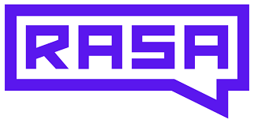

<h1 align="center">👋Hello World</h2>
<p align="center">
  
</p>

<h2  align="center">🚀I'm Kalypso and I'm passionate and curious about programming</h2>
<p align="center">
  
</p>
<h2  align="center">😺A little about me...</h2>

```javascript
const kalypso = {
  realName: "Ángela Antúnez",
  myMottos: ["Curiosity didn't kill the cat: it helped it explore, learn and grow",
            "Every day is an adventure",
            "Just make it happen!",
            "Let's play life-building",
            "Choose wisely your fights",
            "Let your emotions be your friends, not your enemies",
            "Try not to dwell on your failures. Just learn from them",
            "The best antidepressant? Loving yourself!",
            "Don’t let fear take root, because love and success cannot bloom"],
  wasBornIn: "Santander (Spain)",
  livingIn: "Oviedo (Spain)",
  previousAcademicBackground: {
                        degree: "Psychology",
                        mastersDegree: ["Teacher Training", "Socio-educational Intervention and Research"],
                        doctoralThesis: "Education and Psychology",
                        organization: "Universidad de Oviedo"
                      },
  webDevelopmentStudies: {
                        googleCertification: "Google IT Automation with Python",
                        femCodersFactoriaF5Certification: "Full-Stack Developer Bootcamp (850 hours)",
                        aspasiaTrainingCertification: "Level 3 Professional Certificate (590 hours): Development of Applications with Web Technologies."
                    },
  workExperience: {
                    variousSocioEducationalFields: "Work with different NGOs users, and primary and high school students",
                    universidadDeOviedo: ["Field researcher",
                                          "Professor",
                                          "Science communicator",
                                          "Trainer of primary school teachers",
                                          "Inclusive programme designer",
                                          "Intervention technician",
                                          "Program evaluator"],
                    aindaceFoundation: "Project manager of social programmes aimed at people with brain damage",
                    cticTechnologyCentre: "Technician in Human Factor and Web Development",
                    treeHub: "Full-stack developer (Gangenie Project)"
                   },
  myGoal: "Developing applications that are useful, accessible, and inclusive in the fields of psychology and education,
          considering UX design and human factor perspective",
  freeTime: {
                  languages: ["English", "French", "Portuguese"],
                  myDogs: ["Rocky", "Sira"],
                  hobbies: ["Singing", "Dancing", "Acting", "Cooking", "Travelling", "Working out"],
                  favouritePlaces: ["La Virgen del Mar", "Mont Saint-Michel", "Saint-Malo", "Monte Naranco"],
                  },
  myStrengths: ["Curiosity", "Passion", "Initiative", "Motivation", "Sympathy", "Teamwork", "Attention to detail"]
}
```

<h2  align="center">💻Current Stack & Tools</h2>

<p align="center">
  <a href="https://skillicons.dev">
    
  </a>
</p>

<p align="center">
  <a href="https://skillicons.dev">
    
  </a>
</p>

<p align="center">
  <a href="https://skillicons.dev">
    
  </a>
</p>

<p align="center">
  <a href="https://skillicons.dev">
    
  </a>
</p>

<p align="center">
  <a href="https://skillicons.dev">
    
  </a>
</p>

<p align="center">
    &nbsp  
    &nbsp  
    &nbsp
    
    
</p>

<p align="center">
  <a href="https://skillicons.dev">
    
  </a>
</p>

<p align="center">
    &nbsp  
    &nbsp  
    &nbsp
    
</p>
<p align="center">
  
</p>
<h2  align="center">📩Contact me</h2>
  <p align="center">
    <a href="mailto:antunezangela89@gmail.com"></a>
    <a href="https://www.linkedin.com/in/angela-antunez-sanchez/"></a>
  </p>

<h2 align="center">📈Github stats</h2>
<p align="center">
  
</p>


<h2 align="center">🙏Acknowledgements</h2>
<div align="center">
  <a href="https://factoriaf5.org/"></a>&nbsp
  <a href="https://femcoders.factoriaf5.org/"></a>&nbsp
  <a href="https://giphy.com/"></a>&nbsp
  <a href="https://skillicons.dev/"></a>&nbsp
</div>


<!--
**Kalypso89/Kalypso89** is a ✨ _special_ ✨ repository because its `README.md` (this file) appears on your GitHub profile.

Here are some ideas to get you started:

- 🔭 I’m currently working on ...
- 🌱 I’m currently learning ...
- 👯 I’m looking to collaborate on ...
- 🤔 I’m looking for help with ...
- 💬 Ask me about ...
- 📫 How to reach me: ...
- 😄 Pronouns: ...
- ⚡ Fun fact: ...

-->
